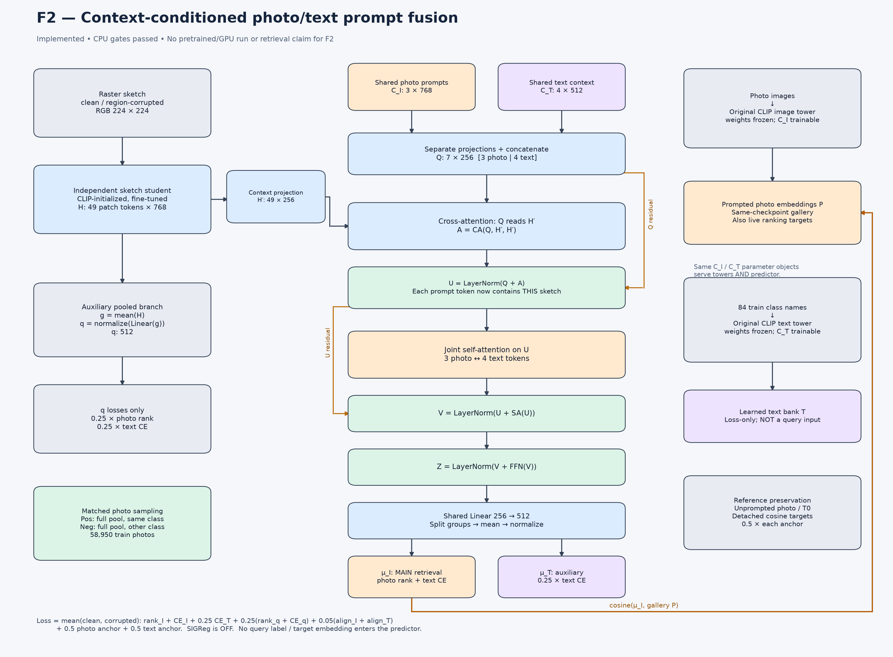

# F2 — contextual photo/text soft-prompt fusion: implementation and CPU readiness

## Status and permission

**Implemented, parent CPU gate13/13 PASS, independent CPU gate13/13 PASS. No F2 pretrained/GPU preflight, real-data optimizer run, production campaign, or retrieval result.** One tiny synthetic CPU AdamW step is part of each gate, not a training experiment.

User approved the implementation and architecture drawing after the [V1 diagnostics](coupled_retrieval_diagnostics_2026-09-08.md). User explicitly chose **main CE(mu_i)=1, auxiliary CE(mu_t)=0.25**; old pooled/alignment/reference coefficients remain unchanged. No inference-head selection or fusion of q/mu_i/mu_t embeddings was requested or added.

New explicit identifiers:

- CLI arm: **`F2`**.
- Architecture: **`predictive_fusion_v2`**.
- Campaign/method: **`coupled_predictive_fusion_v2`**.
- Inference: **`mu_i`**, against photo embeddings encoded using prompts from the same checkpoint.
- SIGReg: **off (`lambda_sig=0`)**. F2 rejects `--diagnostic` before device/cache/data loading; V1's measured lambda is not reused after architecture/loss/sampling changes.

## 1. Architecture drawing



[Vector SVG](designs/coupled_predictive_fusion_v2/architecture.svg) · [PNG](designs/coupled_predictive_fusion_v2/architecture.png)

### Forward equations

Sketch student is an independent CLIP-initialized visual encoder, fine-tuned as in V1. Its unused native `ln_post/proj` remain frozen; patch-token retrieval route is unchanged.

```text
H = sketch_student(sketch)[:, 1:]                   # B × 49 × 768
H' = context_projection(H)                         # B × 49 × 256
Q = concat(photo_projection(C_I), text_projection(C_T))
                                                  # 7 × 256; broadcast across B
A = CrossAttention(Q, H', H')
U = LayerNorm(Q + A)                               # existing residual
S = SelfAttention(U, U, U)                         # NEW: joint photo/text attention
V = FusionLayerNorm(U + S)                         # NEW: contextual residual
Z = LayerNorm(V + FFN(V))                          # existing FFN residual
O = shared_output_projection(Z)                   # B × 7 × 512
mu_i = normalize(mean(O[:, :3], dim=tokens))
mu_t = normalize(mean(O[:, 3:], dim=tokens))
q = normalize(pooled_head(mean(H, dim=tokens)))    # auxiliary, unchanged
```

**Cross-attention first, self-attention second.** Self-attention receives tokens that already depend on this sketch, rather than fusing only global prompts before seeing the sketch. Its residual adds `U`, not a second copy of raw `C_I/C_T`.

- `C_I`:3×768 photo prompt parameters, actual same objects used inside original frozen image tower.
- `C_T`:4×512 learned text-context parameters, actual same objects used inside original frozen text tower.
- New self-attention: width256,4heads, dropout0, batch-first; new LayerNorm256.
- Added module count **263,680 trainable parameters**,6new parameter/state entries. CPU gate directly constructs this width256/4head block, checks count and forward shape `[2,7,256]`.
- From measured V1 parameter counts and this exact addition: predictor1,183,744→**1,447,424**; total trainable89,036,288→**89,299,968**, expected173→179parameter tensors. These full-model totals are arithmetic projections from V1, not a newly executed full-pretrained F2 count/gate.

### What stays frozen / what enters inference

Original CLIP image/text weights—including LN, embeddings, projections and logit scale—stay frozen. Prompt parameters and the separate sketch student/predictor/pooled head train.

The query forward signature remains `forward(sketches)`. No true query label, target photo, learned class-bank embedding, clean-view teacher feature, or caption-specific hint enters it. The global prompts are shared learned priors; fusion becomes sketch-conditioned, but does not create a new text information source for each query.

`mu_i` is still the only main inference output. `q` and `mu_t` remain auxiliary; the strong V1 diagnostic mu_t score was not used to silently change official inference.

## 2. Loss: exact approved weights

For each view v in clean/corrupted:

```text
L_v = rank(mu_i, photo_positive, photo_negative)
    + CE(mu_i, learned_text_bank, class_label)
    + 0.25 * CE(mu_t, learned_text_bank, class_label)
    + 0.25 * [rank(q, photo_positive, photo_negative)
              + CE(q, learned_text_bank, class_label)]
    + 0.05 * [cosine_alignment(mu_i, stopgrad(photo_positive))
              + cosine_alignment(mu_t, stopgrad(class_text_target))]

L = 0.5 * (L_clean + L_corrupted)
  + 0.5 * photo_reference_anchor
  + 0.5 * text_reference_anchor
```

Photo ranking remains `mean softplus(0.2+s_negative-s_positive)` with normalized features; text CE temperature remains0.07. Original unprompted photo and T0 reference targets remain detached. Ranking and CE use live prompted photo/text banks, so both query and learned prompt banks receive their intended gradients.

**Reference anchors are computed once**, over the unique sampled photo bank and complete84-class text bank. The concatenated clean/corrupted student forward and each photo/reference/text-bank encoding are reused, not recomputed separately for each new CE term.

| Term | Weight per view before view average | Actual clean or corrupted leaf coefficient |
|---|---:|---:|
| rank_i |1|0.5|
| **ce_i — new direct semantic supervision** |**1**|**0.5**|
| ce_t auxiliary |0.25|0.125|
| rank_pool |0.25|0.125|
| ce_pool |0.25|0.125|
| align_i |0.05|0.025|
| align_t |0.05|0.025|
| anchor_i |once|0.5|
| anchor_t |once|0.5|

Total CE weight including the pooled branch rises **1.25→1.50**, as explicitly chosen by the user. If every scalar component equals1, F2 total is3.85 (FP32 receipt3.8499999046325684), compared with V1's3.6. The gate differentiates the **production `coupled_region_loss` total** with patched independent scalar leaves; it does not certify derivatives of a copied loss formula.

`task_loss(..., architecture='predictive_fusion_v2')` now means only the view-averaged **rank_i+ce_i**, excluding auxiliary/reference terms. No new SIGReg scale has been measured for that changed task.

## 3. Sampling: same full pool for both roles

F2 explicitly calls:

```python
make_train_loader(protocol, transform, positive_pool="full")
```

This reuses the existing dataset behavior with `positive_pairing=None`:

- Positive: uniformly choose an image among **all train photos in the query class**.
- Negative: uniformly choose another train class, then uniformly choose a photo in that class's **same full photo pool**.
- Active positive and negative universe: **58,950 train photos**, same photo transform.
- Same-class different instances stay relevant positives; no cosine-based removal of difficult different-class negatives.
- Split84train/20pseudo-validation/21official-excluded is unchanged. Train query count46,624 unchanged.
- Canonical pairing manifest46,624records/8,400unique photos remains validated as historical/audit evidence, but is **not the active F2 positive-sampling source**.
- Full ordered photo pool SHA256: `b0dd18492aa9a634ebb04f83ea9f328b8d926301a48886176f5d450533b23973`.
- New pool policy/identity checks are in **`src/spica/data/coupled_training.py`**, not pure model/loss math.

This removes the specific canonical-positive/full-negative asymmetry observed in V1. It does not prove every shortcut is eliminated: query class frequencies, image difficulty and other dataset statistics can still differ. Because targets change, F2 training positive/negative traces must not be asserted equal to historical V1 traces.

Default `positive_pool='canonical'` is retained for V1. The generic dataset and old S0 sampler were not edited.

## 4. Versioning, trainer integration and unchanged behavior

| File | Change |
|---|---|
| `src/spica/models/coupled_predictive.py` | Explicit F2-only contextual self-attention and residual LayerNorm |
| `src/spica/coupled_predictive_losses.py` | F2 ce_i main task, ce_t0.25aux; V1/R0 equations retained |
| `src/spica/data/coupled_training.py` | Validated version routing, explicit full positive pool and identity |
| `src/spica/train_coupled_predictive.py` | Explicit F2 CLI/config/checkpoint/W&B metadata and full-pool routing; no SIG reuse |
| `scripts/check_coupled_fusion_v2_cpu.py` | Standalone CPU checks, fresh receipts, incomplete gate if mandatory artifacts are absent |
| `docs/designs/coupled_predictive_fusion_v2/architecture.{svg,png}` | Architecture drawing |

New fusion modules are initialized **after all V1/common modules including pooled_head**. This preserves the old RNG draws and common initial parameter bytes. F2 is not expected to produce identical mu_i/mu_t outputs: it intentionally adds another operation.

- `pooled`/`predictive` default model/loss paths keep V1 semantics.
- CPU archived comparison confirms R0 and R1 state keys/bytes, forward outputs, loss terms and gradients exact on the tiny fixture.
- F2 adds exactly fusion-attention/norm keys; loading an F2 state into V1 with strict loading is rejected, not silently partially restored.
- Original `scripts/run_coupled_campaign.py` three-arm launcher is **not retargeted** to F2. Historical roots/checkpoints/probes stay intact.
- F2 requires `--arm F2 --campaign-id coupled_predictive_fusion_v2`. Mislabelled campaign and any `--diagnostic` are rejected before device selection/cache/data/model loading.
- Resolved config, checkpoint and W&B config retain method version, architecture, `main_query=mu_i`, exact loss coefficients, active pool identity/counts and audit-only pairing role. F2 run_result/checkpoint campaign is not labelled V1.
- Existing optimizer groups automatically own the new attention/norm parameters once. Matrix decay0.01, vector/bias/LN decay0; student base LR1e-5, predictor/pool1e-4, prompts1e-4/WD1e-4 are unchanged.
- Existing trainer schedule/evaluator/checkpoint plumbing is reused in code. **No full trainer invocation or new schedule/promotion campaign approval is claimed by these CPU gates.**

## 5. CPU verification: actual evidence and limitations

Final parent gate:

`outputs/coupled_fusion_v2_parent_20260909T052000Z/receipt.json`

Final independent execution:

`outputs/coupled_fusion_v2_independent_20260909T051733Z/receipt.json`

Independent review receipt beside it: `independent_review.json`.

Both: **13PASS /0FAIL /0SKIP**, same component-source aggregate:

`167e77faa4a755522ad57b73fe47f9bbda754d75811775cd27634a5e85503a4a`

This is the gate's **component manifest** aggregate (`path + NUL + file_sha256 + NUL`), not a full training-source aggregate. It binds the four changed production files, final checker, and archived V1 model/loss. Parent independently compared every listed file SHA with current bytes after both runs. Later documentation/commit is not an executed training snapshot.

### Coverage

1. F2 CLI misuse rejected before device/data; main inference adapter points to mu_i.
2. Real manifest/pool audit:58,950full vs8,400canonical,256sampled pairs have proper labels; extended positives occur. **No image pixel loading in this data check.**
3. Tiny random OpenCLIP forward/backward, independent student storage and frozen original state.
4. Hooks confirm **CA→SA→FFN**; SA inputs differ between query images.
5. Batched vs separate queries: maximum output delta **5.9604645e-8**, no cross-query-context coupling detected in this fixture.
6. New forward gradient paths: `sum(mu_i)→C_T` absolute-gradient sum **1.1704463**, `sum(mu_t)→C_I` **1.0326844**; corresponding V1 gradients exactly0. These initialization sensitivities do **not** prove useful trained text utilization.
7. Actual prompt parameter ownership; no copied second prompt bank.
8. Production scalar-leaf loss oracle3.85 and every coefficient derivative; direct ce_i dependency on mu_i rather than mu_t/q.
9. Real tiny F2 loss: all47active gradient tensors finite/nonzero; student/predictor/query/text bank each called once, photo live/reference each called once.
10. Optimizer coverage and one synthetic CPU AdamW step:47active tensors changed, original teacher unchanged.
11. State save/load output parity and strict F2→V1 mismatch.
12. Checkpoint/W&B metadata serialization and SIG absent; no online W&B call.
13. Archived R0/R1 parity and common F2 initialization; additionally measured production SA256/4head block count263,680 and shape `[2,7,256]`.

The full-network fixture uses8×8synthetic RGB,1-layer visual/text towers of width8, predictor width8/2heads, embed dimension6. The separate default-size SA check is not a full pretrained model test. **Do not turn47tiny gradients or CPU SA shape into a179tensor/full-CLIP GPU claim.**

Earlier receipts are preserved, including the worker prototype under `outputsnewgate/check_coupled_fusion_v2_cpu_20260909T120019/` and parent intermediate roots051000Z/052000Z. They refer to earlier checker/source states, not this final gate. The parent tightened the checker to differentiate the actual production loss, use valid `[B,1]` negative indices/classes, verify R0 as well as R1, and avoid a false full PASS when required artifacts are skipped.

No new V1 pytest suite or dependency was added. Ruff on touched Python files and `git diff --check` passed. Historical repository tests were not deleted or rewritten; no whole-repository pytest claim.

### Reproduce CPU gate only

```bash
CUDA_VISIBLE_DEVICES='' LD_LIBRARY_PATH=/run/opengl-driver/lib \
OMP_NUM_THREADS=1 MKL_NUM_THREADS=1 OPENBLAS_NUM_THREADS=1 \
.venv/bin/python scripts/check_coupled_fusion_v2_cpu.py \
  --output outputs/<fresh-cpu-gate-directory>
```

PNG/SVG generator is saved at `outputs/coupled_fusion_v2_parent_20260909T052000Z/draw_architecture.py`; it uses already-installed Matplotlib.

## 6. Pending, not automatically authorized

- Real-pretrained/real-data F2 GPU forward/backward, memory and actual optimizer gates.
- New loss-scale/SIGReg diagnostic if SIG is desired; the old fixed lambda is not portable to this changed graph.
- Explicit matched training controls and promotion protocol. Changing sampling, supervision and fusion together does not isolate self-attention's causal contribution.
- Retrieval/hubness/context-shuffle/canonical-pool diagnostics **after** any separately approved F2 training.

These changes create an executable candidate aimed at the observed failure mode. **They do not establish that F2 avoids collapse, improves unseen transfer, or beats S0/R0 before training and evaluation.**
