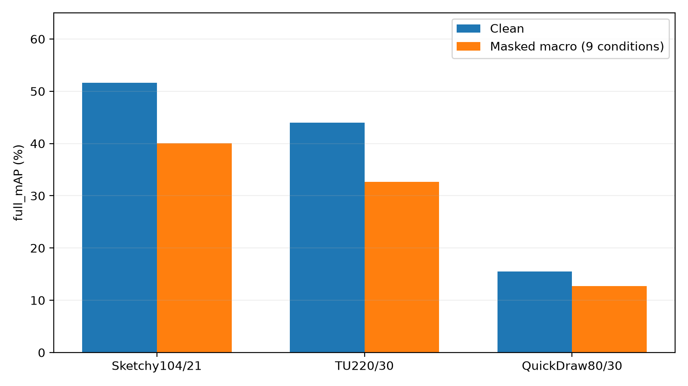
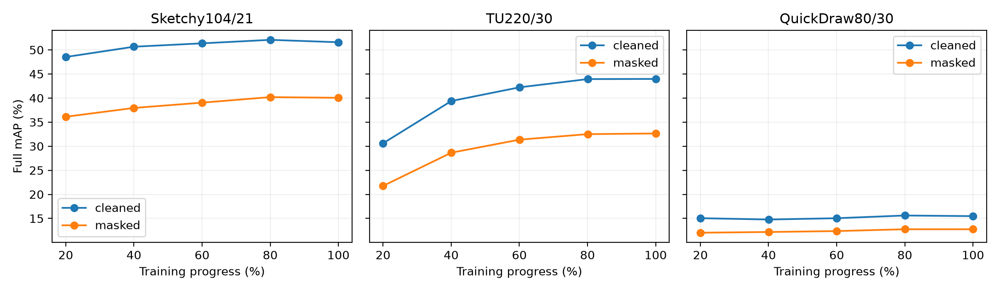
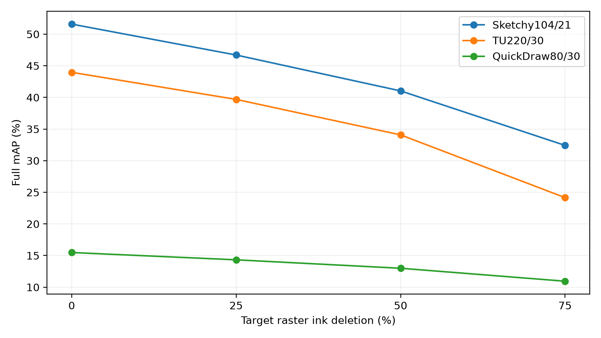

# Kết quả cuối — official MP-Q

Giá trị trong bảng là %. CSV giữ độ chính xác số gốc 0–1.

| Dataset | Clean full mAP | Masked full mAP | Clean P@200 | Masked P@200 | Clean AP200 minR | Masked AP200 minR |
|---|---:|---:|---:|---:|---:|---:|
| Sketchy104/21 | 51.5844 | 40.0467 | 54.9535 | 41.2801 | 42.8148 | 30.1382 |
| TU220/30 | 43.9661 | 32.6385 | 50.2854 | 36.3226 | 42.1831 | 28.9237 |
| QuickDraw80/30 | 15.4787 | 12.7538 | 15.0367 | 11.7917 | 7.6657 | 5.5938 |

Hình severity: mỗi điểm25/50/75% là trung bình3mask seeds ở checkpoint cuối;0% là clean. Đây là mức xóa mục tiêu, không khẳng định mọi mẫu đạt đúng mức đó.

**Cảnh báo:** Sketchy đã đủ4446 và5test nhưng raw campaign FAILED_NO_RETRY do guard source cuối run. TU/Q exit0, raw UNVERIFIED. Kiểm tra ở audit.json chỉ xác minh artifacts/hash/trung bình các metric đã lưu; không chứng nhận encoder replay hay phép sắp xếp độc lập.

Không so trực tiếp Sketchy104/21 với pseudo84/20. Không chọn điểm test tốt nhất thay cho checkpoint cuối. Ba seed mask không phải ba seed training.
