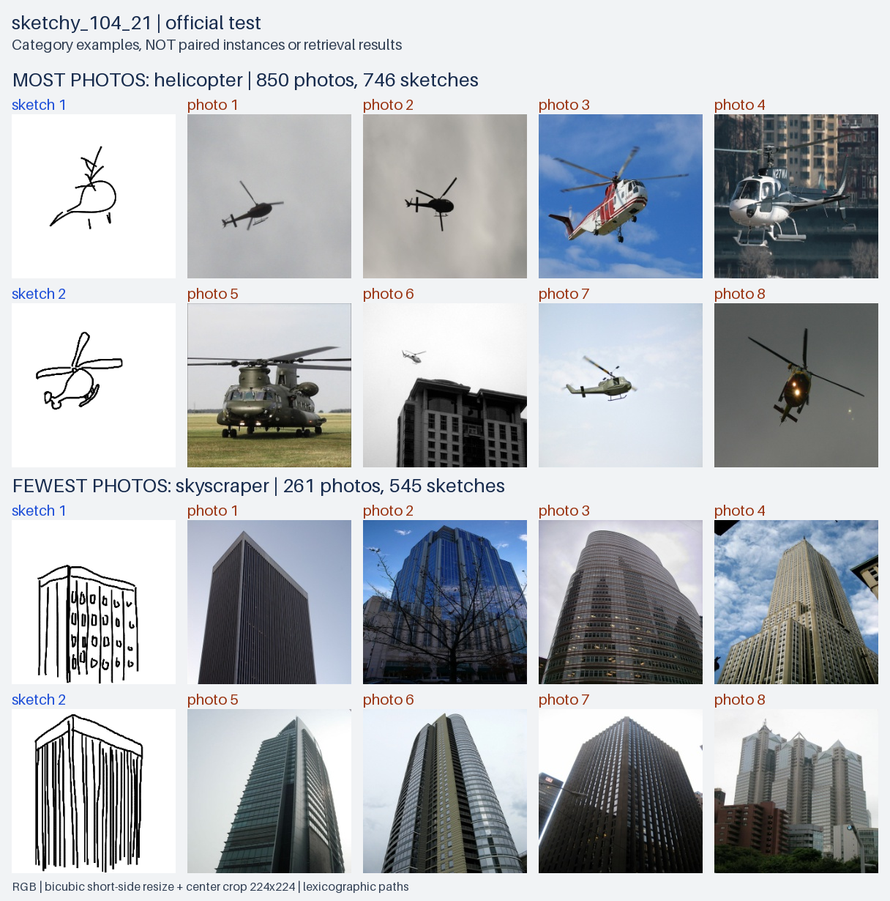
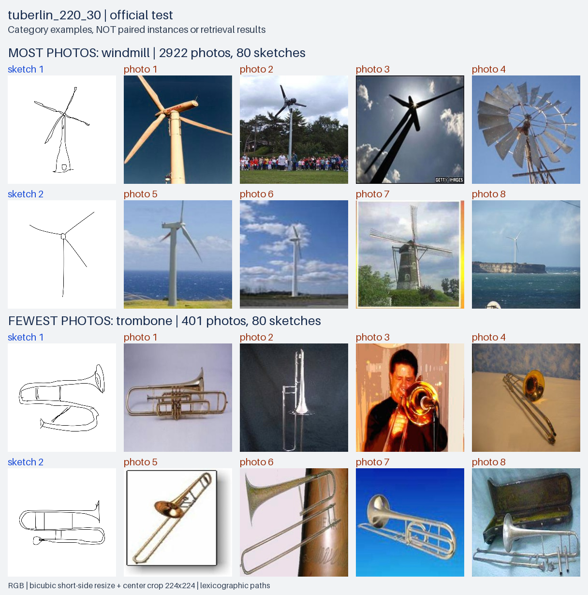
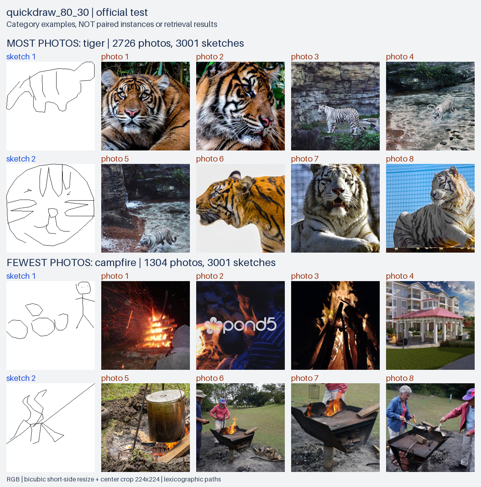

# Preview category official test

Mỗi dataset chọn class có nhiều photo nhất và ít photo nhất; mỗi class gồm **2 sketch + 8 photo**. Cột đầu là sketch, bốn cột còn lại là photo.

Ảnh chọn theo thứ tự đường dẫn, không chọn tay theo độ đẹp. Tất cả ở224×224 theo preprocessing của mô hình; ảnh nguồn không bị sửa. Đây là ví dụ cùng category, **không phải cặp instance hay kết quả retrieval**. Mẫu nhỏ này không đại diện cho toàn bộ phân bố category.

## sketchy_104_21

## tuberlin_220_30

## quickdraw_80_30

[selected_classes.csv](selected_classes.csv) lưu counts/protocol; [image_manifest.csv](image_manifest.csv) lưu path/SHA/vị trí từng ảnh. [Receipt](receipt.json) · [Kiểm tra parent](parent_receipt.json). Category theo nhãn manifest; không khẳng định đã kiểm định ngữ nghĩa từng ảnh. Những ảnh có vẻ khác kỳ vọng vẫn được giữ theo quy tắc chọn đường dẫn, không chọn lại để làm preview đẹp hơn. Trước khi xuất bản lại ảnh trong đồ án/công khai, kiểm tra yêu cầu trích nguồn và quyền sử dụng của dataset.
